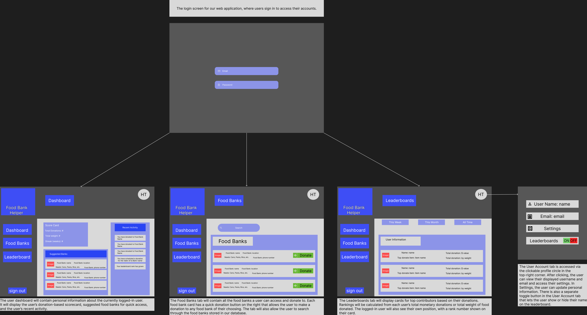

# Brief description & goals

Description: A web application that helps donors find local food banks, make quick donations to specific banks or campaigns, and view community rankings based on donation amount or weight. The app provides a personal dashboard for each logged-in user showing donation history, suggested food banks, and recent activity.

Primary goals

Make donating to food banks quick.

Help users discover nearby or relevant food banks via searchable cards.

Encourage recurring giving and friendly competition via leaderboards.

# Wireframe screenshots & Figma link

Figma Link: [CS351 Group Project - Food Bank Helper](https://www.figma.com/design/RtcEvY3wwY9iBBzhdFpaUh/CS351-Group-Project?)

Screenshots: 

# Why these layouts, flows, and patterns were chosen

Global layout

Left vertical nav: persistent global navigation (Dashboard, Food Banks, Leaderboard). Rationale: quick access to core sections; familiar pattern for web apps and desktop-first workflows.

Top-right profile circle: compact account access and settings; keeps personal actions visually separated from global navigation.

Food bank listing pattern

Card-based listing with donate button on each card: makes it fast for users to donate without navigating to a separate page.

Search bar + Quick filters: helps users find banks by name, location, or need.

Leaderboards

Tabbed time ranges (This Week / This Month / All Time): lets users compare short-term vs long-term contributions, motivates consistent giving and friendly competition.

User’s own rank visible, increases personal engagement and retention.

# Assumptions, limitations & open questions

## Assumptions

Backend API(s) will expose endpoints for: auth (login/signup), list of food banks (with location and donation target), creating donations, user profile, leaderboard data, and recent activity.

Payment/donation processing will be handled via a third-party (Stripe / PayPal) or a server-side donation service. Frontend only needs to call relevant API endpoints or redirect to hosted checkout.

## Limitations

Wireframes assume a desktop-first design; mobile behaviors are not fully shown.

Real-time updates (e.g., live leaderboard) are not defined — would require websockets or polling.

## Open questions

Auth: Do we need OAuth (Google/Apple) in addition to email/password?

Maps & geolocation: Should the Food Banks page support a map view with location-based sorting?

Leaderboard privacy: Can users opt out of appearing? How do we treat usernames (full name vs display handle)?

## Future improvements for frontend

Make front end more animated + beautiful

